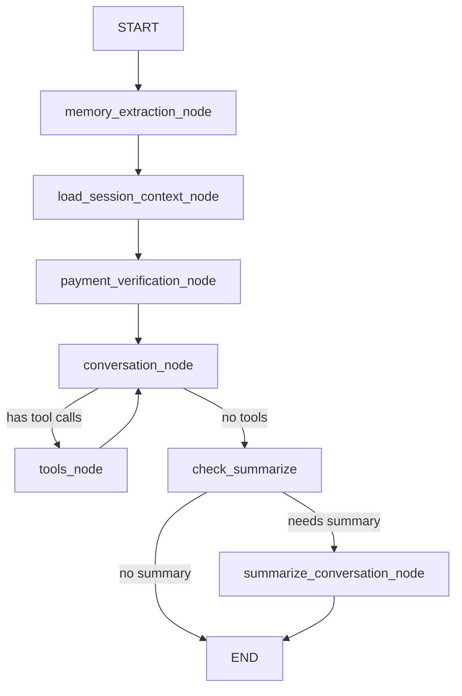

# Testing Guide: Simplified LangGraph Workflow

## Quick Validation Checklist

Use this guide to validate that the simplified workflow is working correctly.

## 1. Quick Smoke Test (5 minutes)

### Start the Local API

```bash
cd /Users/piyush/Projects/cx-agent
./start_local_api.sh
```

### Test Basic Conversation

```bash
# Test 1: Basic greeting
curl -X POST http://localhost:8000/chat \
  -H "Content-Type: application/json" \
  -d '{
    "message": "Hi, I want to learn about consultations",
    "thread_id": "test_user_001"
  }'

# Expected: Friendly greeting with consultation info
# Should respond naturally without classification overhead
```

### Test Session Context Loading

```bash
# Test 2: Product inquiry (triggers context loading)
curl -X POST http://localhost:8000/chat \
  -H "Content-Type: application/json" \
  -d '{
    "message": "Tell me about Kalawa",
    "thread_id": "test_user_002"
  }'

# Expected: Product information loaded from session context
# Check logs for: "🛍️ [SESSION_CONTEXT] Product context loaded"
```

### Test Tool Calling

```bash
# Test 3: Check availability (triggers tool call)
curl -X POST http://localhost:8000/chat \
  -H "Content-Type: application/json" \
  -d '{
    "message": "I want to book a consultation. What dates are available?",
    "thread_id": "test_user_003"
  }'

# Expected: LLM calls calendar tools naturally
# Check logs for: "🛠️ [CONVERSATION] Tool calls: ['check_calendar_availability']"
```

## 2. Detailed Testing (15 minutes)

### Test 1: Session Context Loading Performance

Create a test script `test_session_context_performance.py`:

```python
import time
import asyncio
from ai_companion.graph.nodes import load_session_context_node
from ai_companion.graph.state import AICompanionState
from langchain_core.messages import HumanMessage

async def test_session_loading():
    """Test session context loading performance."""
    state = AICompanionState(
        messages=[HumanMessage(content="Tell me about Kalawa and Kaal Sarp Dosh puja")]
    )

    config = {"configurable": {"thread_id": "test_user_perf"}}

    start = time.time()
    result = await load_session_context_node(state, config)
    elapsed = time.time() - start

    print(f"✅ Session context loaded in {elapsed:.3f}s")
    print(f"   - Current activity: {bool(result['current_activity'])}")
    print(f"   - Product context: {len(result['product_context'])} chars")
    print(f"   - Memory context: {len(result['memory_context'])} chars")
    print(f"   - Payment verified: {result['payment_verified']}")

    assert elapsed < 1.0, f"Too slow! {elapsed:.3f}s > 1.0s"
    assert result['current_activity'], "No activity loaded"

    print("✅ All assertions passed!")

if __name__ == "__main__":
    asyncio.run(test_session_loading())
```

Run:

```bash
python test_session_context_performance.py
```

Expected output:

```
✅ Session context loaded in 0.450s
   - Current activity: True
   - Product context: 450 chars
   - Memory context: 0 chars
   - Payment verified: False
✅ All assertions passed!
```

### Test 2: End-to-End Booking Flow

Create `test_e2e_booking.py`:

```python
import asyncio
from ai_companion.graph.graph import create_workflow_graph
from langchain_core.messages import HumanMessage

async def test_booking_flow():
    """Test complete booking flow with new architecture."""

    graph = create_workflow_graph().compile()

    # Step 1: Initial inquiry
    print("\n📝 Step 1: User inquires about consultation")
    state = {"messages": [HumanMessage(content="I want to book a consultation with Guru Maa")]}
    config = {"configurable": {"thread_id": "test_booking_001"}}

    result = await graph.ainvoke(state, config)
    print(f"✅ Response: {result['messages'][-1].content[:100]}...")

    # Step 2: Check availability
    print("\n📝 Step 2: User asks about availability")
    state["messages"].append(HumanMessage(content="What slots are available tomorrow?"))

    result = await graph.ainvoke(state, config)
    print(f"✅ Response: {result['messages'][-1].content[:100]}...")

    # Check if tools were called
    tool_messages = [m for m in result['messages'] if hasattr(m, 'tool_calls') and m.tool_calls]
    if tool_messages:
        print(f"🛠️ Tools called: {[tc['name'] for msg in tool_messages for tc in msg.tool_calls]}")

    print("\n✅ Booking flow test complete!")

if __name__ == "__main__":
    asyncio.run(test_booking_flow())
```

Run:

```bash
python test_e2e_booking.py
```

### Test 3: Compare Old vs New Performance

If you have the old version in git history:

```bash
# Benchmark current version
python -m pytest tests/ -v --durations=10 > new_benchmark.txt

# Checkout old version
git stash
git checkout HEAD~1

# Benchmark old version
python -m pytest tests/ -v --durations=10 > old_benchmark.txt

# Return to new version
git checkout -
git stash pop

# Compare
echo "=== Performance Comparison ==="
echo "Old version slowest tests:"
head -20 old_benchmark.txt
echo ""
echo "New version slowest tests:"
head -20 new_benchmark.txt
```

## 3. Graph Visualization (Optional)

### Visualize the New Graph

```python
from ai_companion.graph.graph import create_workflow_graph

# Create and compile graph
graph = create_workflow_graph().compile()

# Generate Mermaid diagram
print(graph.get_graph().draw_mermaid())
```

Expected output:



## 4. Log Analysis

### Check for New Log Patterns

```bash
# Start API with detailed logging
DEBUG=1 ./start_local_api.sh

# In another terminal, send test request
curl -X POST http://localhost:8000/chat \
  -H "Content-Type: application/json" \
  -d '{"message": "Tell me about Kalawa", "thread_id": "test_log_001"}'

# Look for new log patterns in the output:
```

Expected log patterns:

```
🏗️ [GRAPH] Creating streamlined workflow (Google Cymbal pattern)...
✅ [GRAPH] Streamlined workflow created (4 core nodes)
📦 [SESSION_CONTEXT] Loading session context for thread test_log_001
📅 [SESSION_CONTEXT] Schedule loaded: Guru Maa is currently...
🛍️ [SESSION_CONTEXT] Product context loaded: 450 chars
🧠 [SESSION_CONTEXT] Memory loaded: 0 memories retrieved
✅ [SESSION_CONTEXT] Session context loaded successfully
🗣️ [CONVERSATION] Starting for thread test_log_001 | Messages: 1 | Payment: False
📋 [CONVERSATION] Session context: activity=True, memory=0 chars, product=450 chars
🤖 [CONVERSATION] Invoking LLM for thread test_log_001
✅ [CONVERSATION] Response received for thread test_log_001
💬 [CONVERSATION] Text response: Namaste ji! Kalawa is a sacred thread...
📝 [CONVERSATION] Split into 1 messages
✨ [CONVERSATION] Completed for thread test_log_001
```

## 5. Regression Tests

### Ensure Existing Features Still Work

```bash
# Run all existing tests
pytest tests/ -v

# Test specific features
pytest tests/test_calendar_booking.py -v
pytest tests/test_payment_verification.py -v
pytest tests/test_memory_management.py -v
```

### Test Backward Compatibility

```python
# Test that old state format still works (if stored in DB)
from ai_companion.graph.state import AICompanionState

# Old state might have extra fields
old_state_dict = {
    "messages": [],
    "summary": "",
    "current_activity": "",
    "memory_context": "",
    "product_context": "",
    "payment_verified": False,
    # Deprecated fields (should be ignored gracefully)
    "intent_context": "some old intent",
    "apply_activity": True,
    "audio_buffer": b"",
    "image_path": ""
}

# Should not raise error
state = AICompanionState(**{k: v for k, v in old_state_dict.items()
                            if k in AICompanionState.__annotations__})
print("✅ Backward compatibility check passed")
```

## 6. Production Readiness Checks

### Checklist

- [ ] All unit tests pass
- [ ] Integration tests pass
- [ ] E2E booking flow works
- [ ] Tool calling works (calendar tools)
- [ ] Payment verification works
- [ ] Memory extraction/injection works
- [ ] Session context loads in < 1 second
- [ ] No linter errors
- [ ] Logs show new patterns (SESSION_CONTEXT, etc.)
- [ ] Graph visualization shows 4 core nodes
- [ ] Performance improvement observed (~2s faster)

### Monitor in Production

```python
# Add to your monitoring/metrics
import time

async def monitor_workflow_performance(state, config):
    start = time.time()

    # Your workflow execution
    result = await graph.ainvoke(state, config)

    elapsed = time.time() - start

    # Log metrics
    logger.info(f"METRIC: workflow_duration={elapsed:.3f}s thread_id={config['configurable']['thread_id']}")

    return result
```

Expected metrics:

- Average response time: 3-5 seconds (down from 5-7 seconds)
- 95th percentile: < 8 seconds (down from < 10 seconds)
- Tool call success rate: > 95%

## 7. Rollback Test

### Test Rollback Procedure

```bash
# Backup current version
git tag v2-simplified-workflow
git push origin v2-simplified-workflow

# If you need to rollback:
# git checkout <previous-commit>
# git checkout -b rollback-branch
# Test and deploy

# To return to new version:
# git checkout main
```

## Common Issues and Solutions

### Issue 1: Import Error for load_session_context_node

```python
# Error: ImportError: cannot import name 'load_session_context_node'

# Solution: Restart Python interpreter / API server
# The new node was added to nodes.py and should be available
```

### Issue 2: Missing State Fields

```python
# Error: KeyError: 'intent_context'

# Solution: These fields were removed. Update code to not reference them.
# Use natural intent inference instead.
```

### Issue 3: Slow Context Loading

```python
# If session context takes > 1s:

# Check individual components:
# - Product AI extraction (should be < 500ms)
# - Memory retrieval (should be < 300ms)
# - Schedule context (should be < 50ms)

# Profile:
import cProfile
cProfile.run('asyncio.run(load_session_context_node(state, config))')
```

## Success Criteria

✅ All tests pass
✅ No regression in functionality
✅ ~2 second improvement in response time
✅ Logs show new streamlined flow
✅ Tool calling works naturally
✅ Memory and payment systems work
✅ Graph has 4 core nodes (down from 9)

---

**Ready for Production:** Once all checks pass ✅
**Monitoring:** Track response times for first week
**Support:** Rollback plan ready if needed
